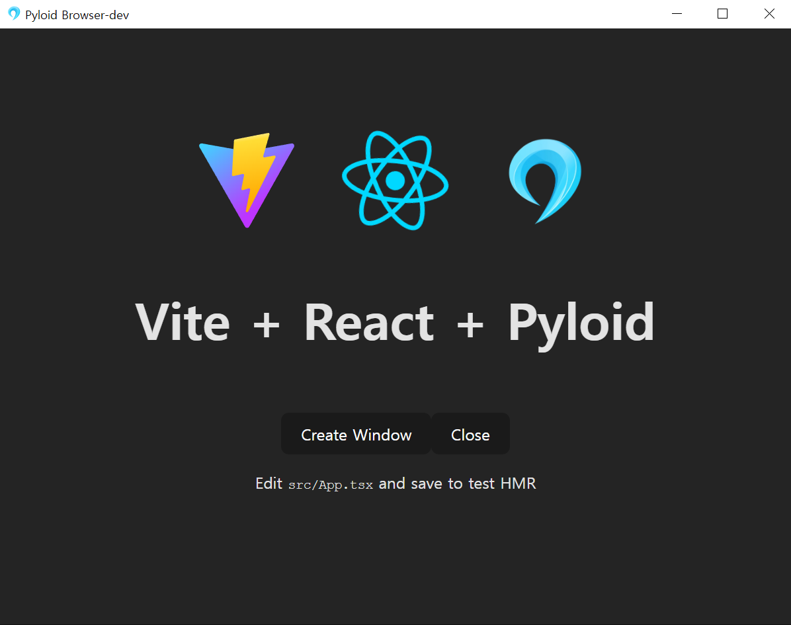

# 💎 Pyloid란 무엇인가요?

## Pyloid 👋

Pyloid는 Electron과 Tauri의 Python 백엔드 버전으로, 데스크톱 애플리케이션 개발을 단순화하기 위해 설계되었습니다. **QtWebEngine**과 **PySide6**를 기반으로 한 이 오픈 소스 프로젝트는 다양한 Python 기능과 원활하게 통합되어 강력한 애플리케이션을 쉽게 구축할 수 있게 해줍니다.

### 🚀 왜 Pyloid인가요?

Pyloid를 사용하면 데스크톱 애플리케이션에서 Python의 모든 기능을 활용할 수 있습니다. 그 단순성과 유연성으로 인해 초보자와 경험 많은 개발자 모두에게 Electron이나 Tauri의 Python 중심 대안으로 완벽한 선택입니다. 특히 AI 기반 데스크톱 애플리케이션 구축에 최적화되어 있습니다.

### 주요 기능 🚀

- **웹 기반 GUI 생성**
- **시스템 트레이 아이콘 지원** 🖥️
- **다중 창 관리**
- **Python과 JavaScript 간 브릿지 API** 🌉
- **단일 인스턴스 애플리케이션 / 다중 인스턴스 애플리케이션 지원**
- **종합적인 데스크톱 앱 기능**
- **깔끔하고 직관적인 코드 구조**
- **실시간 UI 개발 경험**
- **크로스 플랫폼 지원**
- **다양한 프론트엔드 라이브러리와의 통합**
- **창 사용자 정의**
- **PySide6 기능의 직접 활용** 🛠️
- **상세한 Numpy 스타일 docstring** 📚

### 빠른 시작 템플릿 (🛠️ 더 많은 프론트엔드 템플릿이 곧 제공될 예정입니다)

- **HTML/CSS/JS 템플릿**: 기본 웹 기술을 사용하여 앱을 빠르게 시작할 수 있는 템플릿을 제공합니다. [pyloid-html-boilerplate](https://github.com/pyloid/pyloid-html-boilerplate)
- **React 템플릿**: React를 사용하여 현대적인 UI를 구축하기 위한 템플릿을 포함합니다. [pyloid-react-boilerplate](https://github.com/pyloid/pyloid-react-boilerplate)

<table data-view="cards"><thead><tr><th></th><th></th><th data-hidden data-card-cover data-type="files"></th><th data-hidden></th><th data-hidden data-card-target data-type="content-ref"></th></tr></thead><tbody><tr><td><strong>시작하기</strong></td><td>Pyloid 프로젝트 시작</td><td></td><td></td><td><a href="getting-started/prerequisites.md">prerequisites.md</a></td></tr><tr><td>참조</td><td>Python/Js API 참조</td><td></td><td></td><td><a href="api/python-backend/">python-backend</a></td></tr><tr><td><strong>가이드</strong></td><td>Pyloid 가이드</td><td></td><td></td><td><a href="guides/build-guide/">build-guide</a></td></tr></tbody></table>
